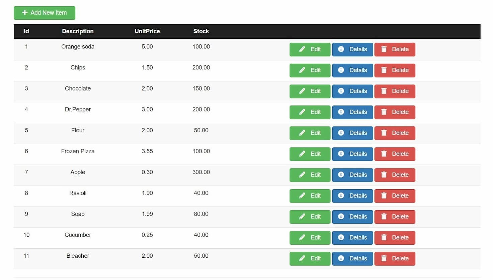
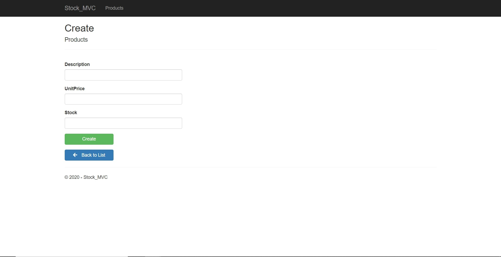
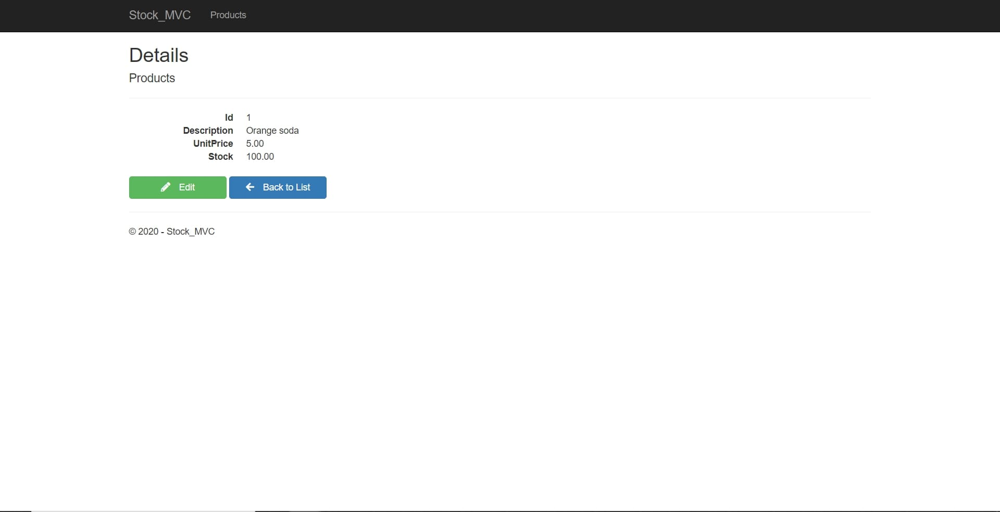
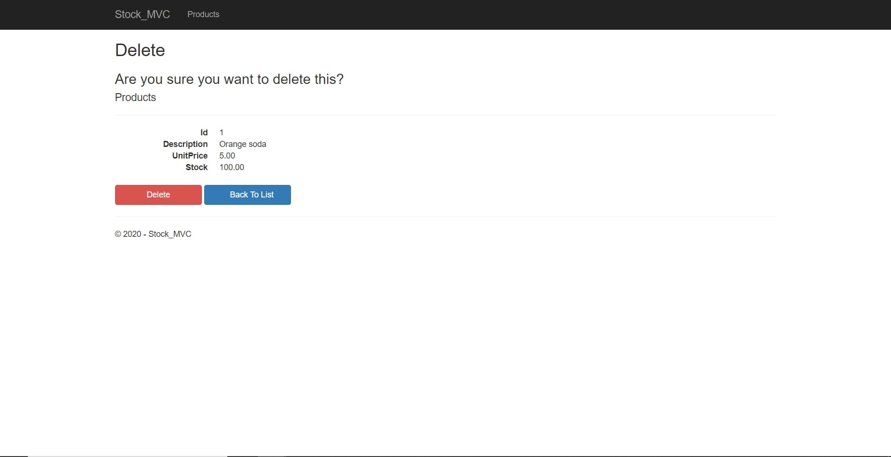
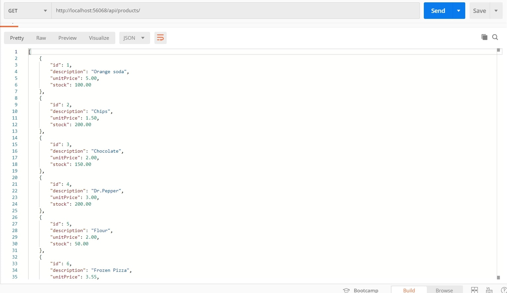

# Stock_Web_Service

This project consist in a web service that provides all the control to create, read, edit and delete items in the store stock and a web app
that can display all this information and manages the views to input all the changes to the database.

## Features
- CRUD operations on inventory system.
- Development and management of REST API.
- MVC architecture.
- Data manage with Entity Framework Core.
- ASP NET CORE MVC.

## We can add a new item calling the POST request of the Stock_API and in the create view of the web app.

## Once created an item data can be checked or edited in the details view of oir web app.

## Lastly we can delete an item if we desire so calling the Delete POST request of the Web_Api.

## We can call the api without using the web app making the desired request using Postman.

